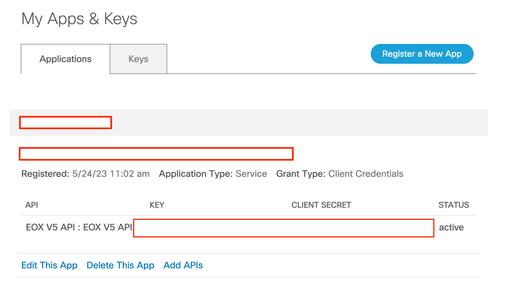
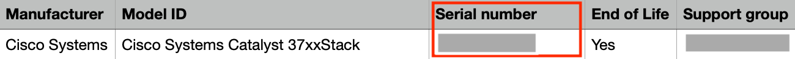
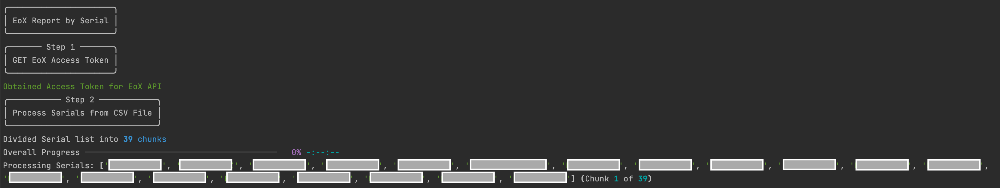
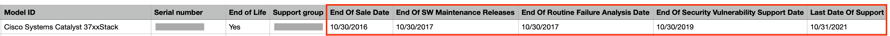

# EoX CSV Report by Serial Number

This script reads an CSV file containing Cisco Product Serial Numbers, and it queries the EoX API to retrieve various date milestones per Serial number. The retrieved information is written back to the CSV File.

This scripts considers the following Milestones:
* End of Sale Date
* End of Software Maintenance Releases Date
* End of Routine Failure Analysis Date
* End of Security Vulnerability Support Date
* Last Date of Support

The code can easily be extended to support more fields. For a full list of supported fields, check out the example in the [documentation](https://developer.cisco.com/docs/support-apis/#!eox/get-eox-by-serial-numbers).

## Contacts
* Trevor Maco
* Jorge Banegas

## Solution Components
* EoX API
* Python 3.11

## Prerequisites

### EoX API

This application requires access to the `EoX API` and the creation of an `App` in [API Console](https://apiconsole.cisco.com/). 

A detailed guide is included [here](https://developer.cisco.com/docs/support-apis/#!user-onboarding-process), with summarized steps bellow:

1. Obtain Access to the `EoX API` by following the `User Onboarding Guide` above. **Note**:  This process includes a few steps and varies depending on the users relationship to Cisco (Customer or Partner) 
2. Sign in to API Console with CEC Credentials
3. Register an `App` of `Application Type` "Service" and `Grant Type`  = "Client Credentials"
    * Note the `key` and `secret`, which are required for authentication!



**Note**: this process may change in the future, always refer to the latest documentation on the platform.

### CSV Input

This script expects an CSV file input with a minimum of:
* A column containing `Serial Numbers`

The name of this column is specified in the `config.py` file. Other columns will be ignored.




## Installation/Configuration
1. Clone this repository with `git clone [repository name]`
2. Add the App Key and App Secret to `config.py` from the prerequisites section
```python
CLIENT_KEY = ""
CLIENT_SECRET = ""
```
3. Add the essential input CSV parameters in `config.py`. Provide the path to the CSV File and the name of the Serial Number Column.
```python
CSV_FILE_NAME = ""
SERIAL_NUMBER_COLUMN_NAME = ""
```
4. Set up a Python virtual environment. Make sure Python 3 is installed in your environment, and if not, you may download Python [here](https://www.python.org/downloads/). Once Python 3 is installed in your environment, you can activate the virtual environment with the instructions found [here](https://docs.python.org/3/tutorial/venv.html).
5. Install the requirements with `pip3 install -r requirements.txt`

## Usage

Run the script with `python3 main.py`

The script will parse the input file, and using the Serial Number, retrieve milestone information from the EoX API.

Serials are processed in batches of 20 to increase processing speed. 

The results are written to a new CSV named: `{input_file_name}_output.csv`. The new CSV contains all the original columns plus the new milestone columns appended to the right-hand side.
* Console Output:



* CSV Output




### LICENSE

Provided under Cisco Sample Code License, for details see [LICENSE](LICENSE.md)

### CODE_OF_CONDUCT

Our code of conduct is available [here](CODE_OF_CONDUCT.md)

### CONTRIBUTING

See our contributing guidelines [here](CONTRIBUTING.md)

#### DISCLAIMER:
<b>Please note:</b> This script is meant for demo purposes only. All tools/ scripts in this repo are released for use "AS IS" without any warranties of any kind, including, but not limited to their installation, use, or performance. Any use of these scripts and tools is at your own risk. There is no guarantee that they have been through thorough testing in a comparable environment and we are not responsible for any damage or data loss incurred with their use.
You are responsible for reviewing and testing any scripts you run thoroughly before use in any non-testing environment.